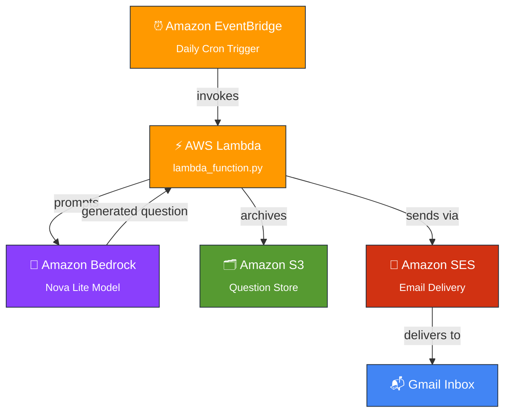

<div align="center">

# 🚀 CodeMentorAI
### Always-On AI Coding Interview Coach

**An autonomous AWS agent that wakes up every day, invents a brand-new coding interview question, and delivers it straight to your inbox — with zero human interaction.**

[](https://aws.amazon.com/)
[](https://aws.amazon.com/bedrock/)
[](https://aws.amazon.com/lambda/)
[](https://www.python.org/)
[](#-license)

*Built for the **AWS "Build an Always-On Agent" Weekend Challenge*** 🏆

<br>


</div>

<br>

## 📌 Overview

**CodeMentorAI** is an *always-on* AI agent that removes the friction from interview prep. There's no app to open and no button to press — the agent runs itself.

Every day, on a fixed schedule, it:

1. **Wakes up** automatically via Amazon EventBridge
2. **Generates** a fresh coding interview question using Amazon Bedrock (Nova Lite)
3. **Archives** the question permanently in Amazon S3
4. **Emails** it directly to you through Amazon SES

No dashboards. No manual triggers. Just a quiet, reliable AI coach that shows up in your inbox — rain or shine.

<br>

## ✨ Features

<table>
<tr>
<td width="50%">

**🤖 AI-Generated Questions**
Fresh, unique coding interview questions generated on-demand by Amazon Bedrock — never the same static question bank.

**📅 Fully Autonomous Scheduling**
Runs every single day without any human intervention, powered by EventBridge cron scheduling.

**⚡ Powered by Bedrock Nova Lite**
Fast, cost-efficient foundation model generation tuned for concise, high-quality prompts.

</td>
<td width="50%">

**☁️ 100% Serverless**
Built entirely on AWS Lambda — no servers to patch, scale, or babysit.

**🗂 Persistent Archive**
Every question is stored in Amazon S3, building a growing personal question bank over time.

**📧 Inbox Delivery**
Daily notifications land straight in your Gmail via Amazon SES — no app-switching required.

</td>
</tr>
</table>

<br>

## 🏗 Architecture

<div align="center">



</div>

The entire pipeline runs **without a single manual step** — from trigger to inbox, it's agentic end-to-end.

<br>

## 🛠 Tech Stack & AWS Services

| Service | Role |
|---|---|
|  | Daily cron-based trigger — the agent's "alarm clock" |
|  | Core compute — orchestrates the entire workflow |
|  | Generates the interview question via Nova Lite |
|  | Durable storage for all generated questions |
|  | Sends the daily email notification |
|  | Secures least-privilege access between services |

<br>

## 📂 Project Structure

```
CodeMentorAI/
│
├── 📄 lambda_function.py     # Core agent logic (generate → store → email)
├── 📘 README.md              # You are here
├── 🏛 architecture/          # Architecture diagrams
├── 🖼 screenshots/           # Console proof-of-work screenshots
└── 📜 LICENSE                # MIT License
```

<br>

## ⚙️ How It Works

```
┌─────────────────────────────────────────────────────────────────┐
│  1. EventBridge fires the Lambda on a daily schedule             │
│  2. Lambda sends a prompt to Amazon Bedrock (Nova Lite)          │
│  3. Bedrock returns a freshly generated coding question          │
│  4. Lambda writes the question as an object into Amazon S3       │
│  5. Lambda formats and sends an email through Amazon SES         │
│  6. The question lands in your Gmail inbox — no clicks needed    │
└─────────────────────────────────────────────────────────────────┘
```

<br>

## 📸 Screenshots

<div align="center">

| | |
|---|---|
| 🔧 **Lambda Function** | ✅ **Lambda Test Success** |
| ⏰ **EventBridge Scheduler** | 🤖 **Amazon Bedrock Console** |
| 🗂 **Amazon S3 Bucket** | 📧 **Amazon SES Setup** |
| 📬 **Gmail Output** | |

*See the [`/screenshots`](./screenshots) folder for full-resolution proof-of-work images.*

</div>

<br>

## 🚀 Future Improvements

- [ ] 🗺️ Weekly DSA Roadmap generation
- [ ] 🗃️ SQL Interview Mode
- [ ] 🏛️ System Design question track
- [ ] 📚 Topic-wise adaptive learning
- [ ] 💬 Slack & Microsoft Teams notifications
- [ ] 📱 Companion mobile application

<br>

## 🧠 Why This Project Matters

This isn't just a script that runs on a timer — it's a demonstration of a true **agentic pattern** on AWS: an autonomous system that perceives (schedule trigger), reasons (Bedrock generation), acts (S3 + SES), and delivers value **without waiting to be asked**. It's a small, focused example of how generative AI can be wired directly into everyday infrastructure to create a genuinely "always-on" experience.

<br>

## 📜 License

This project is licensed under the **MIT License** — see the [LICENSE](./LICENSE) file for details.

<br>

## 👨‍💻 Author

<div align="center">

**Deepak Raj JS**

[](https://github.com/deepakrajjs-29)
[](https://linkedin.com/in/deepak-raj-js)

<br>

⭐ **If you found this project interesting, consider giving it a star!** ⭐

</div>
